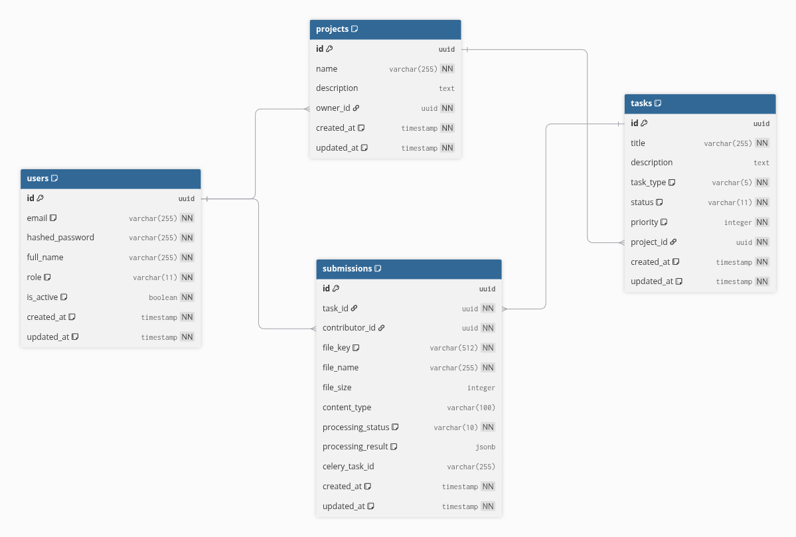

# AnnotateFlow

A scalable AI data annotation and processing platform built with **FastAPI**, **React 19**, **PostgreSQL**, **Celery**, and **MinIO (S3-compatible)**. Contributors upload files, Celery workers process them through an async pipeline, and the dashboard tracks everything in real time.

**Live Demo:** [annotate-flow-one.vercel.app](https://annotate-flow-one.vercel.app) | **API:** [annotateflow-api.onrender.com](https://annotateflow-api.onrender.com) | **API Docs:** [Swagger UI](https://annotateflow-api.onrender.com/docs)

> Note: Free tier server may take ~30s to wake up on first request.

## Architecture

```
                  ┌──────────────┐
                  │   React 19   │  Vite + shadcn/ui + TanStack Query
                  │   Frontend   │  Feature-based architecture
                  └──────┬───────┘
                         │ /api/*
                  ┌──────┴───────┐
                  │   FastAPI    │  Async Python, JWT auth
                  │   Backend    │  Feature-based: auth/projects/tasks/submissions/pipeline
                  └──┬───┬───┬──┘
                     │   │   │
              ┌──────┘   │   └──────┐
              │          │          │
     ┌────────┴──┐  ┌───┴────┐  ┌──┴────────┐
     │PostgreSQL │  │ Redis  │  │   MinIO    │
     │   16      │  │  7     │  │ (S3-compat)│
     │ indexes,  │  │ broker │  │ presigned  │
     │ JSONB     │  │        │  │ URLs       │
     └───────────┘  └───┬────┘  └────────────┘
                        │
                  ┌─────┴──────┐
                  │   Celery   │  Background workers
                  │   Worker   │  Image/audio/text processing
                  └────────────┘
                         │
                  ┌──────┴───────┐
                  │  Groq AI     │  LLM analysis
                  │  (Llama 3.1) │  Sentiment + quality scoring
                  └──────────────┘
```

## Database ERD



[View on dbdiagram.io](https://dbdiagram.io/d/Annotate-Flow-69d18a320f7c9ef2c07d76f2)

## Tech Stack

| Layer | Technology |
|---|---|
| Frontend | React 19, TypeScript, Vite, TailwindCSS 4, shadcn/ui (Radix), TanStack Query |
| Backend | FastAPI, Python 3.12+, Pydantic v2, SQLAlchemy 2.0 (async), Alembic |
| Database | PostgreSQL 16 (B-tree indexes, JSONB, query optimization) |
| Queue | Celery + Redis (background workers, retry logic) |
| Storage | MinIO (S3-compatible, presigned URLs, boto3) |
| AI | Groq (Llama 3.1 8B) — sentiment analysis, quality scoring, tagging |
| Infra | Docker Compose, Makefile, GitHub Actions CI |
| Testing | Pytest (24 backend) + Vitest (11 frontend) |

## Features

- **JWT Authentication** with role-based access (admin/contributor)
- **Project & Task Management** with CRUD operations and status workflow
- **Multi-file Upload** with staged file picker, presigned S3 URLs, and content-type validation
- **Async Processing Pipeline** via Celery workers (image thumbnails, audio metadata, text analysis)
- **Pipeline Monitor** with real-time status polling and processing breakdown
- **File Preview Modal** for images, audio playback, and text content
- **AI-Powered Analysis** via Groq (Llama 3.1) — sentiment badges, quality scores, tags, recommendations
- **Search & Filter** on projects (by name) and tasks (by title, status, type) with ILIKE escape
- **Pagination** with total counts on all list endpoints
- **Analytics Dashboard** with contributor leaderboard, task/type breakdowns, project completion rates
- **Custom Exception Handling** with structured error codes
- **Rate Limiting** on auth (5/min register, 10/min login) and AI endpoints (10/min) via slowapi
- **Structured Logging** with request ID middleware and per-request duration tracking
- **Health Check** with dependency status (Postgres, Redis, MinIO connectivity)
- **Dark/Light Mode** toggle with theme persistence

## Project Structure

```
annotate-flow/
├── backend/
│   └── app/
│       ├── main.py                 # FastAPI app, middleware, routers
│       ├── worker.py               # Celery tasks (file processing)
│       ├── core/                   # Config, database, exceptions, security
│       ├── features/               # Feature modules
│       │   ├── auth/               # Register, login, JWT, dependencies
│       │   ├── projects/           # Project CRUD
│       │   ├── tasks/              # Task CRUD, status workflow
│       │   ├── submissions/        # File upload, S3 presigned URLs
│       │   └── pipeline/           # Processing status & monitoring
│       └── shared/                 # Base model, S3 storage, model registry
├── frontend/
│   └── src/
│       ├── features/               # Feature modules (mirrors backend)
│       │   ├── auth/               # Login page
│       │   ├── projects/           # Project list, hooks, types
│       │   ├── tasks/              # Task board, file upload, submissions
│       │   └── pipeline/           # Pipeline monitor
│       ├── shared/                 # API client, layout
│       └── components/ui/          # shadcn/ui components
├── docker-compose.yml
├── Makefile
└── README.md
```

Frontend and backend share the same feature-based architecture:

```
frontend/src/features/auth/       ↔  backend/app/features/auth/
frontend/src/features/projects/   ↔  backend/app/features/projects/
frontend/src/features/tasks/      ↔  backend/app/features/tasks/
frontend/src/features/pipeline/   ↔  backend/app/features/pipeline/
```

## Quick Start

### Prerequisites
- Docker & Docker Compose
- Python 3.12+
- Node.js 22+ with pnpm
- Make

### Setup

```bash
# Clone
git clone https://github.com/sumoncse19/annotate-flow.git
cd annotate-flow

# Copy environment and add your Groq API key
cp .env.example .env
# Edit .env and set GROQ_API_KEY (free at https://console.groq.com)

# Install dependencies
make install

# Start infrastructure (Postgres, Redis, MinIO)
make db

# Run database migration
make migrate

# Seed demo data (6 users, 3 projects, 10 tasks, 14 submissions)
make seed

# Start all dev servers (API + Celery worker + Frontend)
make dev
```

Demo credentials: `admin@annotateflow.dev` / `admin123`

Open http://localhost:5173 in your browser.

### Docker Compose (Full Stack)

```bash
make up-build
```

This starts all 6 services: PostgreSQL, Redis, MinIO, FastAPI API, Celery Worker, and Frontend (nginx).

### Run Tests

```bash
make test
```

35 tests: 24 backend (Pytest) + 11 frontend (Vitest).

## API Endpoints

| Method | Endpoint | Description |
|---|---|---|
| POST | `/api/auth/register` | Register a new user |
| POST | `/api/auth/login` | Login, returns JWT token |
| GET | `/api/auth/me` | Get current user profile |
| GET | `/api/projects/` | List all projects |
| POST | `/api/projects/` | Create a project |
| GET | `/api/projects/:id` | Get project details |
| DELETE | `/api/projects/:id` | Delete a project |
| GET | `/api/projects/:id/tasks/` | List tasks in a project |
| POST | `/api/projects/:id/tasks/` | Create a task |
| PATCH | `/api/projects/:id/tasks/:id` | Update task (status, type, title) |
| DELETE | `/api/projects/:id/tasks/:id` | Delete a task |
| POST | `/api/tasks/:id/submissions/` | Create submission, get presigned URL |
| POST | `/api/tasks/:id/submissions/:id/confirm` | Confirm upload, trigger processing |
| GET | `/api/tasks/:id/submissions/` | List submissions |
| GET | `/api/tasks/:id/submissions/:id/download-url` | Get presigned download URL |
| POST | `/api/tasks/:id/submissions/:id/analyze` | AI analysis (Groq) with caching |
| GET | `/api/pipeline/status` | Processing status counts |
| GET | `/api/pipeline/recent` | Recent processing jobs |
| GET | `/api/pipeline/analytics` | Platform analytics & contributor stats |
| GET | `/api/health` | Health check |

## Processing Pipeline

```
Upload → Presigned URL → S3 Storage → Celery Worker → Result in DB
```

The Celery worker processes files based on content type:

- **Images**: Extract dimensions, format, mode + generate 200x200 thumbnail
- **Audio**: Extract file metadata
- **Text**: Count characters, words, lines + extract 500-char preview

## Key Design Decisions

- **Feature-based architecture** over layer-based — each domain (auth, projects, tasks) is self-contained with router, schemas, models, and service
- **Presigned URLs** for file upload — files go directly to S3, never through the API server
- **Annotated dependency aliases** (`SessionDep`, `CurrentUser`) for clean function signatures
- **Custom exception hierarchy** (`NotFoundError`, `ForbiddenError`, etc.) with centralized handlers
- **Content-type validation** at both frontend and backend — prevents wrong file types per task
- **LIKE pattern injection prevention** — escapes `%`, `_`, `\` in search inputs before ILIKE queries
- **Rate limiting** with proper 429 responses via slowapi middleware
- **Input validation** — `max_length=200` on search params, Pydantic validation on all request bodies
- **Health check info hiding** — dependency errors logged server-side, only status returned to client

## Services

| Service | Port | URL |
|---|---|---|
| Frontend (Vite dev) | 5173 | http://localhost:5173 |
| Backend API | 8000 | http://localhost:8000 |
| API Docs (Swagger) | 8000 | http://localhost:8000/docs |
| MinIO Console | 9001 | http://localhost:9001 |
| PostgreSQL | 5432 | `localhost:5432` |
| Redis | 6379 | `localhost:6379` |

## Makefile Commands

| Command | Description |
|---|---|
| `make install` | Install backend + frontend dependencies |
| `make dev` | Start infra in Docker + API + Worker + Frontend |
| `make test` | Run backend + frontend test suites |
| `make seed` | Populate database with demo data |
| `make seed-reset` | Clear DB and re-seed |
| `make seed-scale` | Seed + 1200 submissions for EXPLAIN testing |
| `make up-build` | Full Docker Compose build + start |
| `make down` | Stop all containers |
| `make migrate` | Run Alembic migrations |
| `make migrate-create msg="..."` | Generate new migration |
| `make logs-api` | Tail API server logs |
| `make logs-worker` | Tail Celery worker logs |
| `make clean` | Remove build artifacts |
